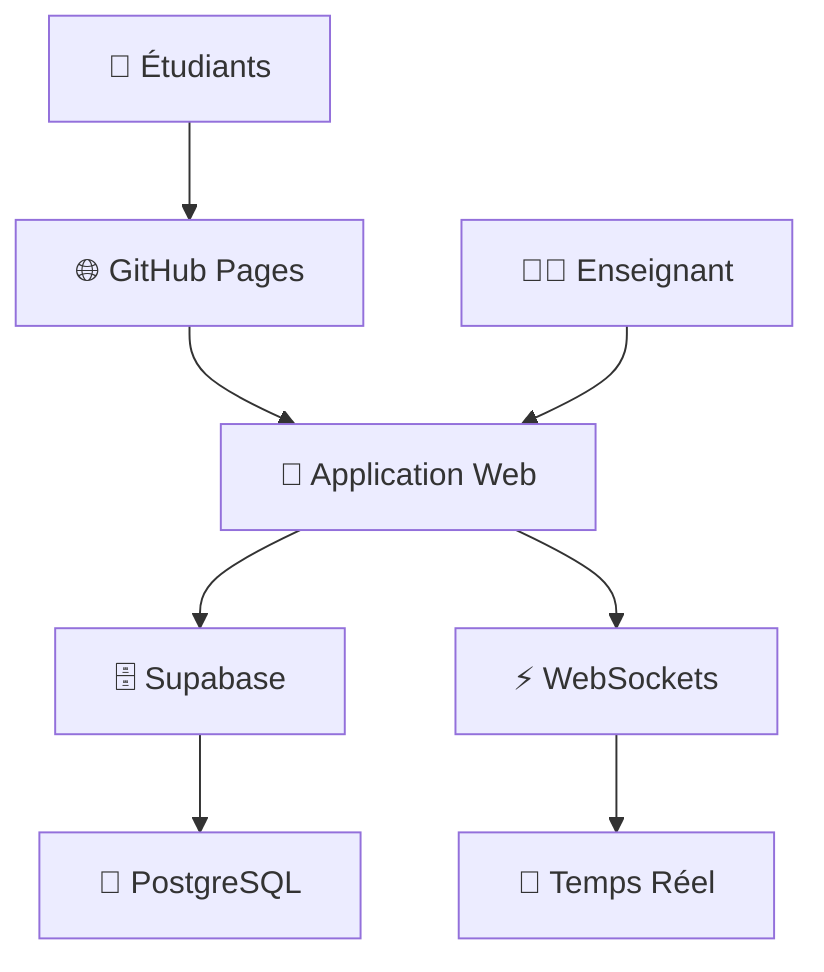
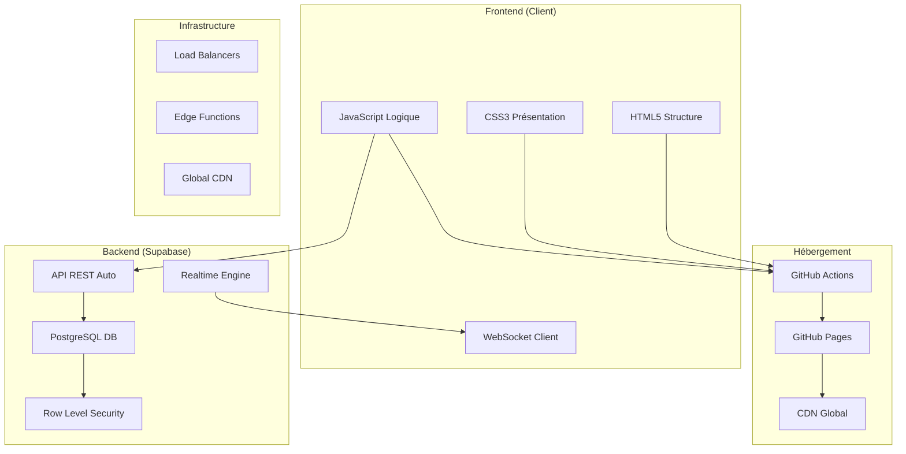
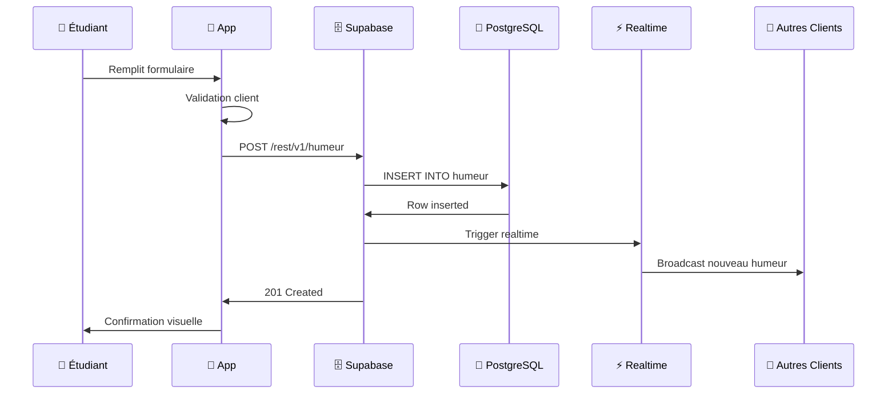
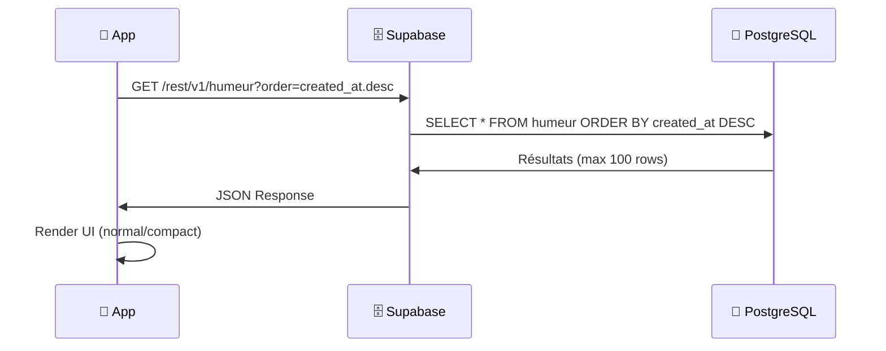

# 🏗️ Architecture Générale - Emoji Code Mood

## 🎯 Objectifs d'Apprentissage

À la fin de ce chapitre, vous saurez :
- Identifier les composants d'une architecture web moderne
- Comprendre le pattern Client-Server avec BaaS (Backend as a Service)
- Analyser les flux de données temps réel
- Reconnaître les avantages/inconvénients de chaque approche architecturale

---

## 🏛️ Vue d'Ensemble de l'Architecture

### **Architecture Simplifiée**



### **Architecture Détaillée**



---

## 🏗️ Analyse des Composants

### **1. Frontend - Application Client**

**Responsabilités :**
- Interface utilisateur interactive
- Validation des données côté client
- Gestion d'état local
- Communication temps réel

**Technologies :**
```javascript
// Structure modulaire
const App = {
    ui: UIManager,        // Gestion interface
    data: DataManager,    // Gestion données
    realtime: WSManager,  // WebSockets
    auth: AuthManager     // Future authentification
};
```

**Avantages :**
- ✅ Réactivité immédiate
- ✅ Expérience utilisateur fluide
- ✅ Réduction charge serveur

**Inconvénients :**
- ❌ Sécurité limitée (côté client)
- ❌ Dépendant de JavaScript
- ❌ SEO plus complexe

### **2. BaaS - Supabase Backend**

**Qu'est-ce que le BaaS ?**
> **Backend as a Service** : Plateforme qui fournit tous les services backend (base de données, API, authentification, temps réel) sans gérer l'infrastructure.

**Services utilisés :**
```sql
-- Base de données PostgreSQL
CREATE TABLE humeur (
    id BIGSERIAL PRIMARY KEY,
    nom TEXT NOT NULL,
    emoji TEXT NOT NULL,
    langage_prefere TEXT NOT NULL,
    autre_preference TEXT NOT NULL,
    commentaire TEXT,
    created_at TIMESTAMPTZ DEFAULT NOW()
);

-- Row Level Security (RLS)
ALTER TABLE humeur ENABLE ROW LEVEL SECURITY;

-- API REST automatique
-- GET /rest/v1/humeur
-- POST /rest/v1/humeur
-- DELETE /rest/v1/humeur
```

**Avantages du BaaS :**
- ✅ **Développement rapide** - Pas d'infrastructure à gérer
- ✅ **Scalabilité automatique** - Gère la montée en charge
- ✅ **Sécurité intégrée** - RLS, authentification, HTTPS
- ✅ **Temps réel natif** - WebSockets inclus

**Inconvénients :**
- ❌ **Vendor Lock-in** - Dépendance au fournisseur
- ❌ **Coûts variables** - Selon l'usage
- ❌ **Personnalisation limitée** - Moins flexible qu'un backend custom

### **3. Hébergement - GitHub Pages**

**Pourquoi GitHub Pages ?**
```yaml
# .github/workflows/deploy.yml
name: Deploy
on:
  push:
    branches: [main]
jobs:
  deploy:
    runs-on: ubuntu-latest
    steps:
      - uses: actions/checkout@v4
      - uses: actions/configure-pages@v4
      - uses: actions/upload-pages-artifact@v3
      - uses: actions/deploy-pages@v4
```

**Avantages :**
- ✅ **Gratuit** pour projets open source
- ✅ **HTTPS automatique** avec certificat SSL
- ✅ **CDN global** pour performances
- ✅ **Intégration Git** native

---

## 🔄 Flux de Données

### **1. Flux d'Écriture (Nouvel Humeur)**



### **2. Flux de Lecture (Chargement Initial)**



### **3. Flux Temps Réel (WebSocket)**

```javascript
// Connexion WebSocket
const channel = supabase
  .channel('humeur_realtime')
  .on('postgres_changes', 
      { event: '*', schema: 'public', table: 'humeur' },
      (payload) => {
        console.log('🔄 Changement:', payload.eventType);
        
        if (payload.eventType === 'INSERT') {
          // Ajouter le nouvel élément en haut
          humeurs.unshift(payload.new);
          updateUI();
        } else if (payload.eventType === 'DELETE') {
          // Recharger la liste complète
          loadAllHumeurs();
        }
      }
  )
  .subscribe();
```

---

## 🆚 Comparaison d'Architectures

### **Architecture Choisie vs Alternatives**

| Critère | **Notre Choix** | **Alternatif 1: LAMP** | **Alternatif 2: MEAN** |
|---------|----------------|----------------------|----------------------|
| **Frontend** | HTML/CSS/JS Vanilla | PHP Mix | Angular/React |
| **Backend** | Supabase BaaS | Apache + PHP + MySQL | Node.js + Express |
| **Base de Données** | PostgreSQL (Supabase) | MySQL | MongoDB |
| **Temps Réel** | Supabase Realtime | Polling/WebSockets custom | Socket.io |
| **Hébergement** | GitHub Pages | Serveur dédié/VPS | Vercel/Netlify + Heroku |
| **Coût** | Gratuit (limites) | Serveur (~10€/mois) | Services (~15€/mois) |
| **Complexité** | 🟢 Faible | 🟡 Moyenne | 🔴 Élevée |
| **Temps Développement** | 🟢 1-2 jours | 🟡 1-2 semaines | 🔴 2-4 semaines |
| **Scalabilité** | 🟢 Automatique | 🟡 Manuelle | 🟢 Bonne |
| **Sécurité** | 🟢 Intégrée | 🔴 À implémenter | 🟡 Configuration |

### **Avantages de Notre Architecture**

**🚀 Vitesse de Développement**
```javascript
// Avec Supabase - 5 lignes
const { data } = await supabase
  .from('humeur')
  .insert([newHumeur])
  .select();

// Avec backend custom - 20+ lignes
app.post('/api/humeur', validation, auth, async (req, res) => {
  try {
    const connection = await mysql.createConnection(config);
    const [result] = await connection.execute(
      'INSERT INTO humeur (nom, emoji, langage_prefere, autre_preference, commentaire) VALUES (?, ?, ?, ?, ?)',
      [req.body.nom, req.body.emoji, req.body.langage_prefere, req.body.autre_preference, req.body.commentaire]
    );
    res.json({ success: true, id: result.insertId });
  } catch (error) {
    res.status(500).json({ error: error.message });
  }
});
```

**🔒 Sécurité Intégrée**
```sql
-- Row Level Security automatique
CREATE POLICY "lecture_publique" 
ON humeur FOR SELECT 
TO public USING (true);

CREATE POLICY "insertion_validee"
ON humeur FOR INSERT 
TO public WITH CHECK (
  length(nom) >= 2 AND 
  length(nom) <= 30
);
```

**⚡ Temps Réel Natif**
```javascript
// Configuration WebSocket en 3 lignes
supabase
  .channel('humeur_realtime')
  .on('postgres_changes', { event: '*', schema: 'public', table: 'humeur' }, handleChange)
  .subscribe();
```

---

## 🎯 Cas d'Usage et Limitations

### **Parfait Pour :**
- ✅ **Prototypes rapides** et MVP
- ✅ **Applications éducatives** et démos
- ✅ **Projets étudiants** avec budget limité
- ✅ **Apps temps réel** simples (chat, collaboration)
- ✅ **Sites statiques** avec interactions

### **Limitations :**
- ❌ **Logique métier complexe** (pas de backend custom)
- ❌ **Intégrations tierces** compliquées 
- ❌ **Contrôle total** sur l'infrastructure
- ❌ **Applications critiques** avec SLA stricts
- ❌ **Volumes très importants** (coûts)

---

## 🔬 Exercices Pratiques

### **Exercice 1 : Analyse d'Architecture**

**Objectif :** Identifier les composants dans le code source

1. **Trouvez** dans `main.js` :
   - La fonction de connexion Supabase
   - Le setup des WebSockets
   - La gestion d'erreurs de connexion

2. **Analysez** dans `index.html` :
   - L'ordre de chargement des scripts
   - Les placeholders de configuration
   - La structure sémantique

3. **Examinez** le workflow `.github/workflows/deploy-secure.yml` :
   - Les étapes de build
   - L'injection des secrets
   - Le déploiement sur Pages

### **Exercice 2 : Modification d'Architecture**

**Scénario :** Votre école veut ajouter l'authentification des étudiants.

**Questions :**
1. Quels composants seraient impactés ?
2. Comment Supabase Auth s'intégrerait ?
3. Quels changements dans le frontend ?
4. Impact sur la sécurité (RLS) ?

**Code à analyser :**
```javascript
// Authentification Supabase (exemple)
const { data: user, error } = await supabase.auth.signIn({
  email: 'etudiant@ecole.fr',
  password: 'motdepasse'
});

// RLS avec authentification
CREATE POLICY "utilisateurs_authentifies" 
ON humeur FOR ALL 
TO authenticated 
USING (auth.uid() IS NOT NULL);
```

### **Exercice 3 : Scalabilité**

**Problème :** L'app devient populaire, 1000+ utilisateurs simultanés.

**Analysez :**
1. **Goulots d'étranglement** potentiels
2. **Solutions Supabase** (plan pro, read replicas)
3. **Optimisations frontend** (pagination, cache)
4. **Monitoring** à mettre en place

---

## 🚀 Aller Plus Loin

### **Ressources Recommandées**

**📚 Livres**
- *Clean Architecture* - Robert C. Martin
- *Building Microservices* - Sam Newman
- *Web Scalability for Startup Engineers* - Artur Ejsmont

**🎥 Cours**
- [Supabase Full Course](https://www.youtube.com/watch?v=7uKQBl9uZ00) - freeCodeCamp
- [PostgreSQL Performance](https://www.postgresql.org/docs/current/performance-tips.html)

**🔧 Outils à Explorer**
- **Supabase CLI** - Développement local
- **PostgreSQL EXPLAIN** - Optimisation requêtes
- **Lighthouse** - Performance audit
- **Chrome DevTools** - Debug WebSockets

### **Projets d'Extension**

**Niveau Débutant**
- Ajouter une page d'administration
- Implémenter la pagination
- Créer un système de thèmes

**Niveau Intermédiaire** 
- Intégrer Supabase Auth
- Ajouter un cache Redis
- Créer des API Edge Functions

**Niveau Avancé**
- Micro-frontend avec Module Federation
- Multi-tenant avec RLS avancé
- Monitoring avec OpenTelemetry

---

## 🤔 Questions de Réflexion

1. **Pourquoi** avoir choisi une architecture BaaS plutôt qu'un backend traditionnel ?

2. **Quels sont** les trade-offs entre simplicité et contrôle dans notre choix ?

3. **Comment** cette architecture évoluerait-elle pour une app commerciale ?

4. **Quels patterns** architecturaux reconnaissez-vous dans le code ?

5. **Si vous deviez** refaire le projet, quels choix changeriez-vous ?

---

## 📝 Résumé

**Concepts Clés Appris :**
- ✅ Architecture Client-Server avec BaaS
- ✅ Séparation des responsabilités (Frontend/Backend)
- ✅ Flux de données synchrones et asynchrones
- ✅ Trade-offs architecturaux (coût, complexité, contrôle)
- ✅ Patterns de communication temps réel

**Prochaine Étape :** [02. Design Patterns](02-design-patterns.md) - Analyser les patterns utilisés dans le code

---

*💡 **Astuce Pédagogique :** Dessinez l'architecture sur papier en suivant un flux utilisateur complet (de la saisie à l'affichage temps réel). Cela aide à mémoriser les interactions entre composants.*

