# 🗄️ Supabase & PostgreSQL - Base de Données Moderne et Temps Réel

---
**Métadonnées**
- **Niveau :** Intermédiaire
- **Durée :** 75 minutes
- **Prérequis :** SQL de base, concepts client-serveur
---

## 🎯 Objectifs d'Apprentissage

À la fin de ce chapitre, vous saurez :
- ✅ Comprendre l'architecture Supabase vs solutions traditionnelles
- ✅ Maîtriser PostgreSQL dans un contexte BaaS (Backend as a Service)
- ✅ Implémenter des requêtes SQL optimisées
- ✅ Utiliser les fonctionnalités temps réel natives
- ✅ Configurer la sécurité avec Row Level Security (RLS)

---

## 🏗️ Architecture Supabase vs Backend Traditionnel

### **1. Évolution des Architectures**

#### **❌ Architecture Traditionnelle (LAMP)**

```mermaid
graph TB
    A[🖥️ Client] --> B[🌐 Apache/Nginx]
    B --> C[🐘 PHP/Node.js]
    C --> D[🗄️ MySQL/PostgreSQL]
    E[👨‍💻 Développeur] --> F[⚙️ Configuration Serveur]
    F --> G[🔧 Gestion Base]
    G --> H[📡 API Custom]
    H --> I[🔒 Sécurité Manual]
```


**Problèmes :**
- ⏰ **Temps de setup** : 2-3 jours minimum
- 💰 **Coût** : Serveur dédié (~50€/mois)
- 🛠️ **Maintenance** : Sauvegardes, mises à jour, sécurité
- 📈 **Scalabilité** : Configuration manuelle complexe
- 🔧 **DevOps** : Expertise système requise

#### **✅ Architecture Supabase (BaaS)**

```mermaid
graph TB
    A[🖥️ Client] --> B[⚡ Supabase API]
    B --> C[🗄️ PostgreSQL Cloud]
    B --> D[📡 Realtime Engine]
    B --> E[🔒 Row Level Security]
    B --> F[📊 Dashboard Admin]
    
    G[👨‍💻 Développeur] --> H[🚀 Deploy Automatique]
    H --> I[📈 Scaling Auto]
```


**Avantages :**
- ⚡ **Setup** : 10 minutes chrono
- 💸 **Coût** : Gratuit jusqu'à 500MB + 2GB bandwidth
- 🔄 **Maintenance** : Automatique
- 📊 **Monitoring** : Dashboard intégré
- 🔐 **Sécurité** : Enterprise-grade par défaut

---

## 🐘 PostgreSQL : Puissance et Modernité

### **2. Pourquoi PostgreSQL vs MySQL ?**

| Fonctionnalité | PostgreSQL ✅ | MySQL ❌ |
|----------------|---------------|----------|
| **Types de données** | JSON, Array, Range, UUID | Limités |
| **Requêtes complexes** | CTEs, Window functions | Basiques |
| **Extensibilité** | Extensions (PostGIS, pg_cron) | Limitée |
| **ACID** | Complet | Incomplet MyISAM |
| **Concurrent reads** | MVCC avancé | Locking |
| **Full-text search** | Intégré | Basique |

### **3. Structure de Base Optimisée**

#### **Table `humeur` dans Emoji Code Mood :**
```sql
-- Table principale avec optimisations PostgreSQL
CREATE TABLE public.humeur (
    id BIGSERIAL PRIMARY KEY,
    nom TEXT NOT NULL,
    emoji TEXT NOT NULL,
    langage_prefere TEXT NOT NULL,
    autre_preference TEXT,
    commentaire TEXT,
    created_at TIMESTAMPTZ DEFAULT NOW(),
    
    -- Métadonnées étendues (JSON flexible)
    metadata JSONB DEFAULT '{}',
    
    -- Contraintes de validation intelligentes
    CONSTRAINT check_nom_length CHECK (length(nom) BETWEEN 2 AND 30),
    CONSTRAINT check_emoji_valid CHECK (length(emoji) BETWEEN 1 AND 10),
    CONSTRAINT check_langage_enum CHECK (langage_prefere IN (
        'javascript', 'typescript', 'python', 'java', 'csharp',
        'php', 'ruby', 'go', 'rust', 'swift', 'kotlin', 'cpp'
    )),
    CONSTRAINT check_commentaire_length CHECK (
        commentaire IS NULL OR length(commentaire) <= 200
    )
);

-- Index optimisés pour les requêtes fréquentes
CREATE INDEX idx_humeur_created_at_desc ON public.humeur(created_at DESC);
CREATE INDEX idx_humeur_langage ON public.humeur(langage_prefere);
CREATE INDEX idx_humeur_emoji ON public.humeur(emoji);
CREATE INDEX idx_humeur_composite ON public.humeur(created_at DESC, langage_prefere);

-- Index pour recherche full-text sur commentaires
CREATE INDEX idx_humeur_commentaire_search 
ON public.humeur 
USING gin(to_tsvector('french', commentaire))
WHERE commentaire IS NOT NULL;

-- Index sur JSONB pour requêtes sur metadata
CREATE INDEX idx_humeur_metadata ON public.humeur USING gin(metadata);
```

### **4. Types de Données Avancés PostgreSQL**

#### **Utilisation de JSONB pour flexibilité :**
```sql
-- Exemples d'usage du champ metadata JSONB
INSERT INTO public.humeur (nom, emoji, langage_prefere, metadata) 
VALUES (
    'Alice',
    '🚀',
    'javascript',
    '{
        "session_info": {
            "browser": "Chrome",
            "version": "120.0",
            "timestamp": "2024-01-15T14:30:00Z"
        },
        "preferences": {
            "dark_mode": true,
            "notifications": false,
            "theme_color": "#3ECF8E"
        },
        "analytics": {
            "is_return_user": false,
            "referrer": "google.com",
            "utm_source": "formation"
        }
    }'::JSONB
);

-- Requêtes sur JSONB
-- Rechercher les utilisateurs avec dark_mode activé
SELECT nom, emoji, metadata->'preferences'->>'dark_mode' as dark_mode
FROM public.humeur 
WHERE metadata->'preferences'->>'dark_mode' = 'true';

-- Statistiques par browser
SELECT 
    metadata->'session_info'->>'browser' as browser,
    COUNT(*) as count
FROM public.humeur 
WHERE metadata->'session_info'->>'browser' IS NOT NULL
GROUP BY metadata->'session_info'->>'browser'
ORDER BY count DESC;

-- Mise à jour partielle de JSONB
UPDATE public.humeur 
SET metadata = metadata || '{"preferences": {"notifications": true}}'::JSONB
WHERE id = 1;
```

#### **Arrays PostgreSQL pour tags :**
```sql
-- Extension de la table avec array de tags
ALTER TABLE public.humeur ADD COLUMN tags TEXT[] DEFAULT '{}';

-- Insertion avec tags
INSERT INTO public.humeur (nom, emoji, langage_prefere, tags) 
VALUES ('Bob', '☕', 'python', ARRAY['débutant', 'motivé', 'café']);

-- Recherche dans les arrays
SELECT nom, emoji, tags
FROM public.humeur 
WHERE 'motivé' = ANY(tags);

-- Recherche multiple tags
SELECT nom, emoji, tags
FROM public.humeur 
WHERE tags && ARRAY['débutant', 'motivé']; -- Intersection

-- Statistiques des tags populaires
SELECT 
    unnest(tags) as tag,
    COUNT(*) as frequency
FROM public.humeur 
WHERE array_length(tags, 1) > 0
GROUP BY tag
ORDER BY frequency DESC
LIMIT 10;
```

---

## ⚡ API Supabase : Plus qu'un ORM

### **5. Client JavaScript Optimisé**

#### **Requêtes simples et performantes :**
```javascript
// Configuration client avec optimisations
const supabase = createClient(supabaseUrl, supabaseKey, {
    db: {
        schema: 'public',
    },
    auth: {
        autoRefreshToken: true,
        persistSession: true,
        detectSessionInUrl: true
    },
    realtime: {
        params: {
            eventsPerSecond: 10 // Throttle realtime events
        }
    }
});

// Requête basique optimisée
const { data, error } = await supabase
    .from('humeur')
    .select('id, nom, emoji, created_at, langage_prefere')
    .order('created_at', { ascending: false })
    .limit(50);

// Requête avec filtre et pagination
const { data, error, count } = await supabase
    .from('humeur')
    .select('*', { count: 'exact' })
    .eq('langage_prefere', 'javascript')
    .range(0, 19) // Pagination : éléments 0-19
    .order('created_at', { ascending: false });

// Requête avec recherche full-text
const { data } = await supabase
    .from('humeur')
    .select('*')
    .textSearch('commentaire', 'motivé | café', {
        type: 'websearch',
        config: 'french'
    });

// Insertion optimisée avec retour des données
const { data, error } = await supabase
    .from('humeur')
    .insert([{
        nom: 'Charlie',
        emoji: '🎯',
        langage_prefere: 'typescript',
        commentaire: 'Premier jour de formation !',
        metadata: {
            session_info: {
                timestamp: new Date().toISOString(),
                user_agent: navigator.userAgent
            }
        }
    }])
    .select('*'); // Retourner l'objet créé avec l'id
```

### **6. Requêtes Avancées avec RPC**

#### **Fonctions PostgreSQL pour logique complexe :**
```sql
-- Fonction pour statistiques avancées
CREATE OR REPLACE FUNCTION get_mood_stats()
RETURNS TABLE (
    total_humeurs INTEGER,
    langages_populaires JSONB,
    emojis_trends JSONB,
    activite_par_heure JSONB
) 
LANGUAGE plpgsql
AS $$
BEGIN
    RETURN QUERY
    SELECT 
        (SELECT COUNT(*)::INTEGER FROM public.humeur) as total_humeurs,
        
        (SELECT jsonb_agg(
            jsonb_build_object('langage', langage_prefere, 'count', count)
            ORDER BY count DESC
        ) FROM (
            SELECT langage_prefere, COUNT(*) as count 
            FROM public.humeur 
            GROUP BY langage_prefere 
            LIMIT 5
        ) sub) as langages_populaires,
        
        (SELECT jsonb_agg(
            jsonb_build_object('emoji', emoji, 'count', count)
            ORDER BY count DESC
        ) FROM (
            SELECT emoji, COUNT(*) as count 
            FROM public.humeur 
            GROUP BY emoji 
            LIMIT 5
        ) sub) as emojis_trends,
        
        (SELECT jsonb_agg(
            jsonb_build_object('heure', heure, 'count', count)
            ORDER BY heure
        ) FROM (
            SELECT EXTRACT(HOUR FROM created_at) as heure, COUNT(*) as count
            FROM public.humeur 
            WHERE created_at >= NOW() - INTERVAL '24 hours'
            GROUP BY EXTRACT(HOUR FROM created_at)
        ) sub) as activite_par_heure;
END;
$$;

-- Fonction de recherche intelligente
CREATE OR REPLACE FUNCTION search_humeurs(
    search_term TEXT DEFAULT NULL,
    filter_language TEXT DEFAULT NULL,
    filter_emoji TEXT DEFAULT NULL,
    limit_results INTEGER DEFAULT 20
)
RETURNS TABLE (
    id BIGINT,
    nom TEXT,
    emoji TEXT,
    langage_prefere TEXT,
    commentaire TEXT,
    created_at TIMESTAMPTZ,
    relevance_score REAL
)
LANGUAGE plpgsql
AS $$
BEGIN
    RETURN QUERY
    SELECT 
        h.id,
        h.nom,
        h.emoji,
        h.langage_prefere,
        h.commentaire,
        h.created_at,
        (
            CASE 
                WHEN h.commentaire IS NULL THEN 0.1
                ELSE ts_rank_cd(
                    to_tsvector('french', h.commentaire), 
                    plainto_tsquery('french', search_term)
                )
            END +
            CASE 
                WHEN filter_emoji IS NULL OR h.emoji = filter_emoji THEN 0.5
                ELSE 0.0
            END +
            CASE 
                WHEN filter_language IS NULL OR h.langage_prefere = filter_language THEN 0.3
                ELSE 0.0
            END
        ) AS relevance_score
    FROM public.humeur h
    WHERE 
        (search_term IS NULL OR 
         to_tsvector('french', COALESCE(h.commentaire, '')) @@ plainto_tsquery('french', search_term))
        AND
        (filter_emoji IS NULL OR h.emoji = filter_emoji)
        AND
        (filter_language IS NULL OR h.langage_prefere = filter_language)
    ORDER BY relevance_score DESC, h.created_at DESC
    LIMIT limit_results;
END;
$$;

-- Usage depuis JavaScript
/*
const { data } = await supabase.rpc('search_humeurs', {
    search_term: 'motivé',
    filter_language: 'javascript',
    limit_results: 10
});
*/
```

---

## 🔒 Sécurité avec Row Level Security

### **7. Politiques RLS Avancées**

```sql
-- Activer RLS sur la table
ALTER TABLE public.humeur ENABLE ROW LEVEL SECURITY;

-- Politique de lecture publique (formation ouverte)
CREATE POLICY "Lecture publique" ON public.humeur 
FOR SELECT TO public USING (true);

-- Politique d'insertion avec validation
CREATE POLICY "Insertion contrôlée" ON public.humeur 
FOR INSERT TO public 
WITH CHECK (
    -- Validation des champs obligatoires
    nom IS NOT NULL AND length(nom) BETWEEN 2 AND 30 AND
    emoji IS NOT NULL AND length(emoji) BETWEEN 1 AND 10 AND
    langage_prefere IS NOT NULL AND
    -- Limitation du commentaire
    (commentaire IS NULL OR length(commentaire) <= 200) AND
    -- Prévention du spam (max 5 insertions par IP par minute)
    (
        SELECT COUNT(*) 
        FROM public.humeur 
        WHERE created_at > NOW() - INTERVAL '1 minute'
        AND metadata->>'client_ip' = (current_setting('request.headers')::json->>'x-forwarded-for')
    ) < 5
);

-- Politique de suppression (admin seulement)
CREATE POLICY "Suppression admin" ON public.humeur 
FOR DELETE TO authenticated 
USING (
    EXISTS (
        SELECT 1 FROM auth.users 
        WHERE auth.users.id = auth.uid() 
        AND auth.users.email IN ('admin@school.com', 'teacher@school.com')
    )
);

-- Politique de mise à jour (correction de typos)
CREATE POLICY "Modification limitée" ON public.humeur 
FOR UPDATE TO public 
USING (created_at > NOW() - INTERVAL '5 minutes') -- Seulement les 5 dernières minutes
WITH CHECK (
    -- Ne permettre que la modification du commentaire
    nom = OLD.nom AND
    emoji = OLD.emoji AND
    langage_prefere = OLD.langage_prefere AND
    autre_preference = OLD.autre_preference AND
    created_at = OLD.created_at
);
```

### **8. Audit et Logging**

#### **Table d'audit automatique :**
```sql
-- Table d'audit pour traçabilité
CREATE TABLE public.humeur_audit (
    id BIGSERIAL PRIMARY KEY,
    humeur_id BIGINT,
    operation TEXT NOT NULL, -- INSERT, UPDATE, DELETE
    old_data JSONB,
    new_data JSONB,
    user_info JSONB,
    created_at TIMESTAMPTZ DEFAULT NOW()
);

-- Fonction trigger pour audit automatique
CREATE OR REPLACE FUNCTION audit_humeur_changes()
RETURNS TRIGGER AS $$
BEGIN
    INSERT INTO public.humeur_audit (
        humeur_id, 
        operation, 
        old_data, 
        new_data, 
        user_info
    ) VALUES (
        COALESCE(NEW.id, OLD.id),
        TG_OP,
        CASE WHEN TG_OP = 'DELETE' THEN row_to_json(OLD) ELSE NULL END,
        CASE WHEN TG_OP != 'DELETE' THEN row_to_json(NEW) ELSE NULL END,
        jsonb_build_object(
            'timestamp', NOW(),
            'ip_address', current_setting('request.headers')::json->>'x-forwarded-for',
            'user_agent', current_setting('request.headers')::json->>'user-agent'
        )
    );
    
    RETURN COALESCE(NEW, OLD);
END;
$$ LANGUAGE plpgsql;

-- Activer le trigger sur tous les événements
CREATE TRIGGER humeur_audit_trigger
    AFTER INSERT OR UPDATE OR DELETE ON public.humeur
    FOR EACH ROW EXECUTE FUNCTION audit_humeur_changes();
```

---

## 📊 Analytics et Performance

### **9. Métriques en Temps Réel**

#### **Vue matérialisée pour statistiques :**
```sql
-- Vue matérialisée pour performance
CREATE MATERIALIZED VIEW public.humeur_stats AS
SELECT 
    DATE(created_at) as date,
    COUNT(*) as total_humeurs,
    COUNT(DISTINCT nom) as utilisateurs_uniques,
    jsonb_agg(DISTINCT langage_prefere) as langages_utilises,
    jsonb_agg(DISTINCT emoji) as emojis_utilises,
    AVG(length(COALESCE(commentaire, ''))) as longueur_moyenne_commentaire,
    COUNT(*) FILTER (WHERE commentaire IS NOT NULL) as avec_commentaire,
    COUNT(*) FILTER (WHERE commentaire IS NULL) as sans_commentaire
FROM public.humeur
GROUP BY DATE(created_at)
ORDER BY date DESC;

-- Refresh automatique chaque heure
SELECT cron.schedule(
    'refresh-humeur-stats',
    '0 * * * *', -- Chaque heure à la minute 0
    'REFRESH MATERIALIZED VIEW public.humeur_stats;'
);

-- Index pour performance de la vue
CREATE INDEX idx_humeur_stats_date ON public.humeur_stats(date DESC);
```

#### **Dashboard analytics accessible via RPC :**
```sql
-- Fonction pour dashboard temps réel
CREATE OR REPLACE FUNCTION get_realtime_dashboard()
RETURNS JSONB
LANGUAGE plpgsql
AS $$
DECLARE
    result JSONB;
BEGIN
    SELECT jsonb_build_object(
        'total_humeurs', (SELECT COUNT(*) FROM public.humeur),
        'humeurs_today', (
            SELECT COUNT(*) FROM public.humeur 
            WHERE created_at >= CURRENT_DATE
        ),
        'top_languages', (
            SELECT jsonb_agg(
                jsonb_build_object('name', langage_prefere, 'count', count)
                ORDER BY count DESC
            ) FROM (
                SELECT langage_prefere, COUNT(*) as count 
                FROM public.humeur 
                GROUP BY langage_prefere 
                LIMIT 5
            ) sub
        ),
        'activity_last_24h', (
            SELECT jsonb_agg(
                jsonb_build_object('hour', hour, 'count', count)
                ORDER BY hour
            ) FROM (
                SELECT 
                    EXTRACT(HOUR FROM created_at) as hour,
                    COUNT(*) as count
                FROM public.humeur 
                WHERE created_at >= NOW() - INTERVAL '24 hours'
                GROUP BY EXTRACT(HOUR FROM created_at)
            ) sub
        ),
        'emoji_distribution', (
            SELECT jsonb_agg(
                jsonb_build_object('emoji', emoji, 'count', count, 'percentage', percentage)
                ORDER BY count DESC
            ) FROM (
                SELECT 
                    emoji,
                    COUNT(*) as count,
                    ROUND(COUNT(*) * 100.0 / SUM(COUNT(*)) OVER(), 2) as percentage
                FROM public.humeur 
                GROUP BY emoji
                LIMIT 10
            ) sub
        )
    ) INTO result;
    
    RETURN result;
END;
$$;
```

---

## 🚀 Optimisations Avancées

### **10. Connection Pooling et Performance**

#### **Configuration Supabase optimisée :**
```javascript
// Configuration de production avec pool de connexions
const supabase = createClient(supabaseUrl, supabaseKey, {
    db: {
        schema: 'public',
    },
    auth: {
        autoRefreshToken: true,
        persistSession: false, // Pour éviter les fuites mémoire
    },
    realtime: {
        params: {
            eventsPerSecond: 10,
        }
    },
    global: {
        headers: {
            'x-application-name': 'emoji-code-mood',
        },
    },
});

// Cache intelligent des requêtes fréquentes
class SupabaseCache {
    constructor(ttlMs = 30000) { // 30 secondes par défaut
        this.cache = new Map();
        this.ttl = ttlMs;
    }
    
    generateKey(table, query, filters) {
        return `${table}_${JSON.stringify(query)}_${JSON.stringify(filters)}`;
    }
    
    async get(key, queryFn) {
        const cached = this.cache.get(key);
        
        if (cached && Date.now() - cached.timestamp < this.ttl) {
            console.log('📦 Cache hit:', key);
            return cached.data;
        }
        
        console.log('🔄 Cache miss, fetching:', key);
        const data = await queryFn();
        
        this.cache.set(key, {
            data,
            timestamp: Date.now()
        });
        
        return data;
    }
    
    invalidate(pattern) {
        for (const key of this.cache.keys()) {
            if (key.includes(pattern)) {
                this.cache.delete(key);
            }
        }
    }
}

// Instance globale du cache
const supabaseCache = new SupabaseCache(30000); // 30 secondes

// Utilisation avec cache automatique
async function getHumeurs(filters = {}) {
    const cacheKey = supabaseCache.generateKey('humeur', 'select', filters);
    
    return await supabaseCache.get(cacheKey, async () => {
        const query = supabase
            .from('humeur')
            .select('id, nom, emoji, langage_prefere, created_at, commentaire')
            .order('created_at', { ascending: false })
            .limit(100);
            
        if (filters.language) {
            query.eq('langage_prefere', filters.language);
        }
        
        const { data, error } = await query;
        if (error) throw error;
        
        return data;
    });
}

// Invalidation du cache lors d'ajouts
async function addHumeur(humeur) {
    const { data, error } = await supabase
        .from('humeur')
        .insert([humeur])
        .select('*');
        
    if (!error) {
        // Invalider le cache pour forcer le refresh
        supabaseCache.invalidate('humeur');
    }
    
    return { data, error };
}
```

### **11. Monitoring et Alertes**

#### **Système d'alertes automatiques :**
```sql
-- Fonction de monitoring pour détecter les anomalies
CREATE OR REPLACE FUNCTION check_system_health()
RETURNS JSONB
LANGUAGE plpgsql
AS $$
DECLARE
    result JSONB;
    recent_activity INTEGER;
    avg_response_time INTERVAL;
BEGIN
    -- Vérifier l'activité récente
    SELECT COUNT(*) INTO recent_activity
    FROM public.humeur 
    WHERE created_at >= NOW() - INTERVAL '1 hour';
    
    -- Construire le rapport de santé
    SELECT jsonb_build_object(
        'timestamp', NOW(),
        'status', CASE 
            WHEN recent_activity > 100 THEN 'high_activity'
            WHEN recent_activity > 10 THEN 'normal'
            ELSE 'low_activity'
        END,
        'recent_activity', recent_activity,
        'total_records', (SELECT COUNT(*) FROM public.humeur),
        'disk_usage', pg_size_pretty(pg_total_relation_size('public.humeur')),
        'alerts', (
            SELECT jsonb_agg(alert) FROM (
                SELECT 'Activité inhabituelle détectée' as alert
                WHERE recent_activity > 500
                UNION ALL
                SELECT 'Base de données importante' as alert
                WHERE (SELECT COUNT(*) FROM public.humeur) > 10000
            ) alerts WHERE alert IS NOT NULL
        )
    ) INTO result;
    
    RETURN result;
END;
$$;

-- Planifier le monitoring toutes les 15 minutes
SELECT cron.schedule(
    'system-health-check',
    '*/15 * * * *',
    'SELECT check_system_health();'
);
```

---

## ✅ Récapitulatif

**Supabase & PostgreSQL maîtrisés :**
- ✅ **Architecture BaaS** vs solutions traditionnelles
- ✅ **PostgreSQL avancé** avec types JSON, arrays, full-text search
- ✅ **API Supabase** optimisée avec cache et requêtes intelligentes
- ✅ **Sécurité RLS** avec politiques granulaires
- ✅ **Monitoring** et analytics temps réel
- ✅ **Performance** avec index, vues matérialisées et cache

**Impact sur le développement :**
- 🚀 **Rapidité de développement** : 10 min vs 2-3 jours
- 💰 **Coût réduit** : Gratuit vs 50€/mois
- 🛡️ **Sécurité enterprise** intégrée par défaut  
- 📊 **Analytics** et monitoring automatiques
- ⚡ **Performance** optimisée avec PostgreSQL moderne

---

**Prochaine étape :** [09. Gestion d'État](09-gestion-etat.md) - State management moderne

---

*💡 **Astuce Pédagogique :** Utilisez le dashboard Supabase pour montrer en direct les requêtes SQL générées par l'API JavaScript pendant vos démonstrations.*
