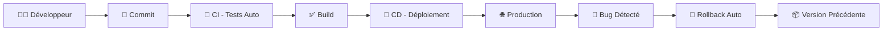
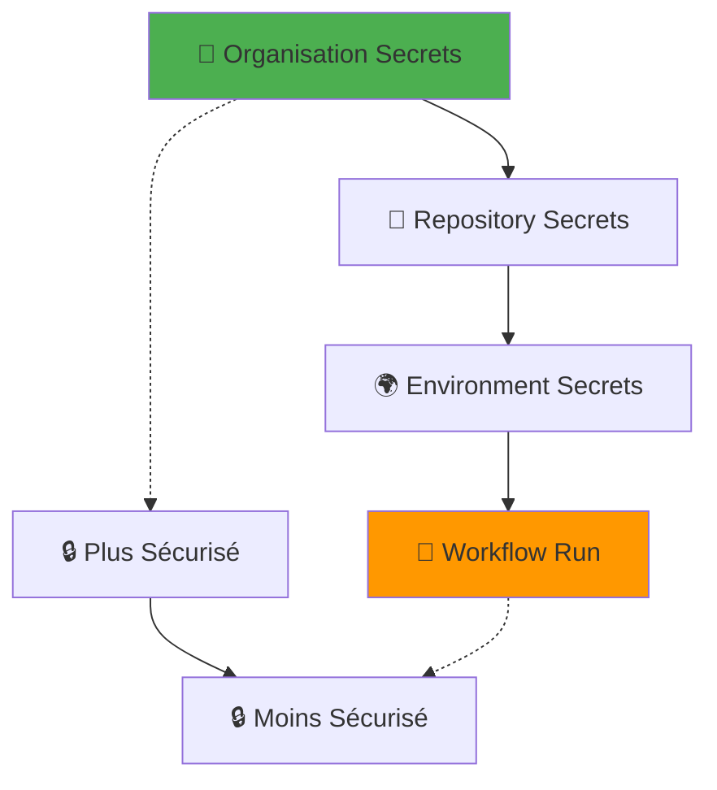

env:
    API_TOKEN: ${{ secrets.API_TOKEN }}
```

---

## ⚡ Optimisation des Workflows

### **1. Cache et Performance**

```yaml
# Cache des dépendances Node.js
- name: Cache Node modules
  uses: actions/cache@v3
  with:
    path: ~/.npm
    key: ${{ runner.os }}-node-${{ hashFiles('**/package-lock.json') }}
    restore-keys: |
      ${{ runner.os }}-node-

# Cache Docker layers
- name: Cache Docker layers
  uses: actions/cache@v3
  with:
    path: /tmp/.buildx-cache
    key: ${{ runner.os }}-buildx-${{ github.sha }}
    restore-keys: |
      ${{ runner.os }}-buildx-
```

### **2. Workflows Conditionnels**

```yaml
# Déploiement conditionnel selon les changements
- name: Detect changes
  id: changes
  uses: dorny/paths-filter@v2
  with:
    filters: |
      frontend:
        - 'src/**'
        - 'public/**'
        - '*.html'
        - '*.css'
        - '*.js'
      docs:
        - 'docs/**'
        - '*.md'

- name: Deploy frontend
  if: steps.changes.outputs.frontend == 'true'
  run: |
    echo "Frontend modifié - Déploiement nécessaire"
    # Logique de déploiement

- name: Deploy documentation
  if: steps.changes.outputs.docs == 'true'
  run: |
    echo "Documentation modifiée - Mise à jour docs"
    # Logique de déploiement docs
```

### **3. Matrix Strategy pour Tests Multi-Environnements**

```yaml
jobs:
  test:
    runs-on: ${{ matrix.os }}
    strategy:
      matrix:
        os: [ubuntu-latest, windows-latest, macos-latest]
        node-version: [16.x, 18.x, 20.x]
        browser: [chrome, firefox, safari]
        exclude:
          - os: ubuntu-latest
            browser: safari  # Safari pas disponible sur Ubuntu
          - os: windows-latest  
            browser: safari  # Safari pas disponible sur Windows
    
    steps:
      - uses: actions/checkout@v4
      - name: Setup Node.js ${{ matrix.node-version }}
        uses: actions/setup-node@v3
        with:
          node-version: ${{ matrix.node-version }}
      
      - name: Run tests on ${{ matrix.browser }}
        run: npm test -- --browser=${{ matrix.browser }}
```

---

## 🔧 Anatomie d'un Workflow Robuste

### **1. Gestion d'Erreurs et Retry**

```yaml
- name: Deploy with retry
  uses: nick-invision/retry@v2
  with:
    timeout_minutes: 10
    max_attempts: 3
    retry_wait_seconds: 30
    command: |
      # Commande qui peut échouer occasionnellement
      curl -f ${{ secrets.WEBHOOK_URL }} || exit 1

- name: Deploy with custom retry logic
  run: |
    for i in {1..3}; do
      echo "Tentative $i/3"
      if curl -f "${{ secrets.DEPLOY_ENDPOINT }}"; then
        echo "✅ Déploiement réussi"
        break
      elif [ $i -eq 3 ]; then
        echo "❌ Échec après 3 tentatives"
        exit 1
      else
        echo "⏳ Attente avant nouvelle tentative..."
        sleep $(( i * 10 ))  # Backoff exponentiel
      fi
    done
```

### **2. Notifications et Alertes**

```yaml
- name: Notify success
  if: success()
  uses: 8398a7/action-slack@v3
  with:
    status: success
    text: "🎉 Déploiement réussi - ${{ github.event.head_commit.message }}"
  env:
    SLACK_WEBHOOK_URL: ${{ secrets.SLACK_WEBHOOK }}

- name: Notify failure  
  if: failure()
  uses: 8398a7/action-slack@v3
  with:
    status: failure
    text: "❌ Échec du déploiement - Commit: ${{ github.sha }}"
  env:
    SLACK_WEBHOOK_URL: ${{ secrets.SLACK_WEBHOOK }}

# Notification par email
- name: Email notification
  if: always()  # Toujours exécuter
  uses: dawidd6/action-send-mail@v3
  with:
    server_address: smtp.gmail.com
    server_port: 587
    username: ${{ secrets.EMAIL_USERNAME }}
    password: ${{ secrets.EMAIL_PASSWORD }}
    to: professor@university.edu
    subject: "Deploy Status: ${{ job.status }}"
    body: |
      Commit: ${{ github.event.head_commit.message }}
      Author: ${{ github.event.head_commit.author.name }}
      URL: ${{ github.event.repository.html_url }}
      Status: ${{ job.status }}
```

### **3. Artefacts et Debugging**

```yaml
- name: Generate build info
  run: |
    # Créer un fichier de métadonnées
    cat > build-info.json << EOF
    {
      "timestamp": "$(date -Iseconds)",
      "commit": "${{ github.sha }}",
      "author": "${{ github.actor }}",
      "branch": "${{ github.ref_name }}",
      "workflow": "${{ github.workflow }}",
      "runId": "${{ github.run_id }}",
      "buildNumber": "${{ github.run_number }}"
    }
    EOF

- name: Upload build artifacts
  if: always()  # Même en cas d'échec
  uses: actions/upload-artifact@v3
  with:
    name: build-artifacts-${{ github.run_number }}
    path: |
      build-info.json
      private-config.js
      *.log
    retention-days: 30  # Garder 30 jours

- name: Upload logs on failure
  if: failure()
  run: |
    # Collecter les logs pour debug
    docker logs container_name > docker.log 2>&1 || true
    npm run logs > npm.log 2>&1 || true
```

---

## 🔬 Workflows Avancés

### **1. Multi-Environment Deployment**

```yaml
# Workflow pour déploiement staging → production
name: Multi-Environment Deploy

on:
  push:
    branches: [develop]  # Staging
  release:
    types: [published]   # Production

jobs:
  deploy-staging:
    if: github.ref == 'refs/heads/develop'
    environment: staging
    runs-on: ubuntu-latest
    steps:
      - uses: actions/checkout@v4
      - name: Deploy to staging
        run: |
          echo "🚧 Déploiement sur staging"
          # Configuration staging
          echo "SUPABASE_URL=${{ secrets.STAGING_SUPABASE_URL }}" > .env
          # Deploy logic
          
  deploy-production:
    if: github.event_name == 'release'
    environment: production
    runs-on: ubuntu-latest
    needs: [run-tests]  # Attendre les tests
    steps:
      - uses: actions/checkout@v4
      - name: Deploy to production
        run: |
          echo "🚀 Déploiement en production"
          # Configuration production avec validation
          if [ -z "${{ secrets.PROD_SUPABASE_URL }}" ]; then
            echo "❌ Secrets production manquants"
            exit 1
          fi
```

### **2. Testing Pipeline Intégré**

```yaml
jobs:
  test:
    runs-on: ubuntu-latest
    steps:
      - uses: actions/checkout@v4
      - uses: actions/setup-node@v3
        with:
          node-version: '18.x'
          cache: 'npm'
      
      # Tests unitaires
      - name: Unit tests
        run: |
          npm ci
          npm run test:unit
          
      # Tests d'intégration  
      - name: Integration tests
        run: |
          # Démarrer Supabase local pour les tests
          npx supabase start
          npm run test:integration
          npx supabase stop
          
      # Tests E2E avec Playwright
      - name: E2E tests
        run: |
          npx playwright install
          npm run test:e2e
          
      # Upload des résultats
      - name: Upload test results
        if: always()
        uses: actions/upload-artifact@v3
        with:
          name: test-results
          path: |
            coverage/
            test-results/
            playwright-report/

  # Le déploiement ne se fait que si les tests passent
  deploy:
    needs: test
    if: success()
    # ... logique de déploiement
```

### **3. Blue-Green Deployment Simulation**

```yaml
jobs:
  deploy:
    runs-on: ubuntu-latest
    steps:
      - name: Deploy to blue environment
        run: |
          # Déployer sur un environnement "bleu"
          echo "🔵 Déploiement Blue Environment"
          # Upload vers blue-deployment branch
          
      - name: Health check blue
        run: |
          # Vérifier que le déploiement fonctionne
          sleep 30  # Attendre le démarrage
          curl -f https://blue.app.com/health || exit 1
          
      - name: Switch traffic to blue
        run: |
          # Basculer le trafic vers blue
          echo "🔄 Basculement du trafic"
          # Update DNS or load balancer
          
      - name: Cleanup green environment
        run: |
          # Nettoyer l'ancien environnement
          echo "🟢 Nettoyage Green Environment"
```

---

## 🔬 Exercices Pratiques

### **Exercice 1 : Créer un Workflow de Test**

Créez un workflow `.github/workflows/test.yml` qui :

```yaml
name: 🧪 Tests Automatiques

on: [push, pull_request]

jobs:
  lint-and-test:
    runs-on: ubuntu-latest
    steps:
      # 1. Checkout du code
      # 2. Setup Node.js
      # 3. Install dependencies  
      # 4. Run ESLint
      # 5. Run tests with coverage
      # 6. Upload coverage to Codecov
```

### **Exercice 2 : Workflow Multi-Branches**

Implémentez une stratégie Git Flow :

```yaml
# develop → staging
# main → production  
# feature/* → review apps
```

### **Exercice 3 : Monitoring et Alertes**

Créez un système d'alerte qui :
- Vérifie la santé de l'app toutes les 5 minutes
- Envoie une alerte Slack si down
- Génère un rapport quotidien d'usage

```yaml
name: 📊 Health Check
on:
  schedule:
    - cron: '*/5 * * * *'  # Toutes les 5 minutes
```

---

## 🚀 Aller Plus Loin

### **Actions GitHub Avancées**

```yaml
# Déploiement avec approbation manuelle
environment:
  name: production
  url: ${{ steps.deploy.outputs.url }}
  # Nécessite une approbation manuelle avant déploiement

# Workflow réutilisable
uses: ./.github/workflows/deploy-reusable.yml
with:
  environment: production
secrets:
  api-key: ${{ secrets.PROD_API_KEY }}

# Self-hosted runners pour plus de contrôle
runs-on: [self-hosted, linux, x64, production]
```

### **Ressources Recommandées**

**📚 Documentation**
- [GitHub Actions Docs](https://docs.github.com/en/actions)
- [Workflow Syntax](https://docs.github.com/en/actions/using-workflows/workflow-syntax-for-github-actions)
- [Security Hardening](https://docs.github.com/en/actions/security-guides/security-hardening-for-github-actions)

**🛠️ Outils Complémentaires**
- [Act](https://github.com/nektos/act) - Tester GitHub Actions localement
- [Actionlint](https://github.com/rhymond/actionlint) - Linter pour workflows
- [GitHub CLI](https://cli.github.com/) - Gestion en ligne de commande

### **Exemples de Workflows Avancés**

```yaml
# Déploiement avec rollback automatique
name: Deploy with Auto-Rollback
jobs:
  deploy:
    steps:
      - name: Deploy new version
        id: deploy
        run: ./deploy.sh
        
      - name: Health check
        run: |
          sleep 60  # Attendre le démarrage
          if ! curl -f ${{ env.APP_URL }}/health; then
            echo "❌ Health check failed - Rolling back"
            ./rollback.sh
            exit 1
          fi
          
      - name: Smoke tests
        run: |
          # Tests basiques post-déploiement
          npm run test:smoke
```

---

## 📊 Métriques et Observabilité

### **Intégration avec Monitoring**

```yaml
- name: Deploy and monitor
  run: |
    # Déploiement
    ./deploy.sh
    
    # Envoyer métriques de déploiement
    curl -X POST https://api.datadog.com/api/v1/events \
      -H "DD-API-KEY: ${{ secrets.DATADOG_API_KEY }}" \
      -d '{
        "title": "Deployment Success",
        "text": "App deployed successfully",
        "tags": ["environment:production", "service:emoji-code-mood"],
        "alert_type": "success"
      }'

- name: Update deployment status
  run: |
    # Mettre à jour le statut dans une DB de monitoring
    psql "${{ secrets.MONITORING_DB_URL }}" -c "
      INSERT INTO deployments (commit_sha, status, deployed_at) 
      VALUES ('${{ github.sha }}', 'success', NOW())
    "
```

---

## 🔍 Debug et Troubleshooting

### **Techniques de Debug Avancées**

```yaml
- name: Debug with tmate (Remote SSH)
  if: failure()
  uses: mxschmitt/action-tmate@v3
  timeout-minutes: 30
  # Ouvre une session SSH pour debug en direct !

- name: Debug environment
  if: failure()
  run: |
    echo "=== ENVIRONMENT DEBUG ==="
    echo "Runner OS: ${{ runner.os }}"
    echo "GitHub Context:"
    echo "  Event: ${{ github.event_name }}"
    echo "  Ref: ${{ github.ref }}"
    echo "  Actor: ${{ github.actor }}"
    echo "  SHA: ${{ github.sha }}"
    echo ""
    echo "=== SYSTEM INFO ==="
    uname -a
    df -h
    free -h
    ps aux --sort=-%cpu | head -10
    echo ""
    echo "=== NETWORK INFO ==="
    curl -s https://httpbin.org/ip
    ping -c 3 supabase.com || true
    
- name: Capture logs on failure
  if: failure()
  run: |
    # Collecter tous les logs possibles
    mkdir -p debug-logs
    
    # Logs système
    journalctl --no-pager > debug-logs/system.log || true
    dmesg > debug-logs/dmesg.log || true
    
    # Logs application
    cat /var/log/nginx/error.log > debug-logs/nginx.log 2>/dev/null || true
    
    # Variables d'environnement (sans secrets)
    env | grep -v SECRET | grep -v TOKEN | grep -v KEY > debug-logs/env.log
    
    # État des processus
    ps aux > debug-logs/processes.log
    
    # Upload pour analyse
    tar -czf debug-logs.tar.gz debug-logs/
```

### **Monitoring des Performances de Build**

```yaml
- name: Build performance metrics
  run: |
    start_time=$(date +%s)
    
    # Build principal
    npm run build
    
    end_time=$(date +%s)
    build_duration=$((end_time - start_time))
    
    echo "📊 Build terminé en ${build_duration}s"
    
    # Envoyer métriques à un service de monitoring
    curl -X POST "${{ secrets.METRICS_ENDPOINT }}" \
      -H "Authorization: Bearer ${{ secrets.METRICS_TOKEN }}" \
      -d "{
        \"metric\": \"build_duration\",
        \"value\": ${build_duration},
        \"tags\": {
          \"repo\": \"${{ github.repository }}\",
          \"branch\": \"${{ github.ref_name }}\",
          \"runner\": \"${{ runner.os }}\"
        }
      }"
```

---

## 🔐 Sécurité Avancée des Workflows

### **1. Isolation et Permissions Minimales**

```yaml
# Permissions granulaires par job
jobs:
  build:
    permissions:
      contents: read        # Lire le code seulement
      # Pas de write, pas de packages, etc.
    runs-on: ubuntu-latest
    steps:
      - uses: actions/checkout@v4
      - name: Build only
        run: npm run build

  deploy:
    permissions:
      contents: read
      pages: write          # Écrire sur Pages seulement
      id-token: write       # Token pour authentification
    needs: build
    environment: production # Protection supplémentaire
    runs-on: ubuntu-latest
```

### **2. Validation des Inputs**

```yaml
on:
  workflow_dispatch:
    inputs:
      environment:
        description: 'Environment to deploy'
        required: true
        default: 'staging'
        type: choice
        options:
          - staging
          - production
      version:
        description: 'Version to deploy'
        required: true
        type: string

jobs:
  deploy:
    steps:
      - name: Validate inputs
        run: |
          # Validation stricte des inputs
          if [[ ! "${{ inputs.environment }}" =~ ^(staging|production)$ ]]; then
            echo "❌ Environnement invalide: ${{ inputs.environment }}"
            exit 1
          fi
          
          if [[ ! "${{ inputs.version }}" =~ ^v[0-9]+\.[0-9]+\.[0-9]+$ ]]; then
            echo "❌ Format de version invalide: ${{ inputs.version }}"
            exit 1
          fi
          
          echo "✅ Inputs validés"
```

### **3. Supply Chain Security**

```yaml
- name: Security scan
  run: |
    # Audit des dépendances npm
    npm audit --audit-level high
    
    # Scan des vulnérabilités avec Trivy
    docker run --rm -v "$PWD:/workspace" aquasec/trivy fs /workspace
    
    # Vérification des signatures Git
    git verify-commit HEAD || echo "⚠️ Commit non signé"

- name: SAST (Static Application Security Testing)
  uses: github/codeql-action/init@v2
  with:
    languages: javascript
    
- name: Build for analysis
  run: npm run build
  
- name: Perform CodeQL Analysis
  uses: github/codeql-action/analyze@v2
```

---

## 🎯 Patterns de Workflow Courants

### **1. Feature Branch Workflow**

```yaml
name: Feature Branch Pipeline

on:
  pull_request:
    branches: [main]
    types: [opened, synchronize, reopened]

jobs:
  validate:
    runs-on: ubuntu-latest
    steps:
      - uses: actions/checkout@v4
        with:
          fetch-depth: 0  # Historique complet pour comparaison
          
      - name: Check for sensitive changes
        run: |
          # Vérifier si des fichiers sensibles ont été modifiés
          changed_files=$(git diff --name-only origin/main...HEAD)
          
          if echo "$changed_files" | grep -E "\.(yml|yaml)$"; then
            echo "⚠️ Modifications de workflows détectées"
            echo "Review supplémentaire requise"
            # Ajouter un label au PR
            gh pr edit --add-label "workflow-changes"
          fi
        env:
          GITHUB_TOKEN: ${{ secrets.GITHUB_TOKEN }}

  preview-deploy:
    runs-on: ubuntu-latest
    steps:
      - name: Deploy preview
        run: |
          # Créer un déploiement temporaire pour review
          preview_url="https://preview-${{ github.event.number }}.app.com"
          echo "🔍 Preview disponible: $preview_url"
          
          # Commenter le PR avec l'URL
          gh pr comment --body "🔍 **Preview déployé:** $preview_url"
        env:
          GITHUB_TOKEN: ${{ secrets.GITHUB_TOKEN }}
```

### **2. Hotfix Emergency Workflow**

```yaml
name: 🚨 Emergency Hotfix

on:
  push:
    branches: [hotfix/*]

jobs:
  emergency-deploy:
    runs-on: ubuntu-latest
    environment: production
    steps:
      - name: Fast track validation
        run: |
          echo "🚨 Déploiement d'urgence activé"
          echo "Branch: ${{ github.ref_name }}"
          
          # Validation minimale mais obligatoire
          if [[ ! "${{ github.ref_name }}" =~ ^hotfix/[a-z0-9-]+$ ]]; then
            echo "❌ Nom de branche hotfix invalide"
            exit 1
          fi

      - name: Emergency deploy
        run: |
          # Déploiement accéléré avec tests critiques seulement
          npm ci --only=production
          npm run test:critical
          npm run build:production
          ./deploy-emergency.sh
          
      - name: Post-deploy monitoring
        run: |
          # Surveillance renforcée post-hotfix
          for i in {1..10}; do
            if curl -f ${{ env.APP_URL }}/health; then
              echo "✅ Health check $i/10 OK"
            else
              echo "❌ Health check $i/10 FAILED"
              ./rollback-emergency.sh
              exit 1
            fi
            sleep 30
          done
```

---

## 🔬 Exercices Avancés

### **Exercice 1 : Pipeline de Sécurité**

Créez un workflow qui :
1. Scanne les vulnérabilités des dépendances
2. Vérifie les secrets hardcodés  
3. Teste les permissions RLS
4. Génère un rapport de sécurité

```yaml
name: 🔒 Security Pipeline
# Votre implémentation ici
```

### **Exercice 2 : Déploiement Multi-Cloud**

Déployez simultanément sur :
- GitHub Pages (primaire)
- Netlify (backup) 
- Vercel (test)

Avec basculement automatique si l'un tombe.

### **Exercice 3 : Workflow avec Approval**

Implémentez un système où :
- Les déploiements en production nécessitent 2 approbations
- Les enseignants peuvent approuver
- Timeout automatique après 24h

---

## 📝 Résumé

**Concepts CI/CD Maîtrisés :**
- ✅ **Workflows GitHub Actions** - Syntaxe et structure
- ✅ **Gestion des secrets** - Sécurisation des variables sensibles
- ✅ **Pipeline de déploiement** - Automatisation complète
- ✅ **Tests automatisés** - Validation continue
- ✅ **Monitoring** - Observabilité et alertes
- ✅ **Rollback** - Retour en arrière automatique
- ✅ **Multi-environnements** - Staging/Production

**Bonnes Pratiques Appliquées :**
- 🔒 **Security First** - Sécurité intégrée dès le début
- 🧪 **Test Everything** - Tests automatiques obligatoires
- 📊 **Monitor Always** - Surveillance continue
- 🔄 **Fail Fast** - Détection rapide des problèmes
- 📋 **Document Everything** - Workflows auto-documentés

**Prochaine Étape :** [14. GitHub Pages](14-github-pages.md) - Hébergement et optimisation

---

*💡 **Astuce Pédagogique :** Créez volontairement une erreur dans le workflow (ex: mauvais secret) et observez comment GitHub Actions la détecte et gère l'échec. C'est la meilleure façon d'apprendre le debugging !*
    echo "# 🚀 GitHub Actions et CI/CD - Pipeline de Déploiement

## 🎯 Objectifs d'Apprentissage

À la fin de ce chapitre, vous saurez :
- Comprendre les concepts CI/CD (Continuous Integration/Continuous Deployment)
- Analyser le pipeline GitHub Actions d'Emoji Code Mood
- Créer des workflows automatisés robustes
- Intégrer la gestion des secrets et la sécurité
- Optimiser les performances et la fiabilité du déploiement

---

## 🔄 Introduction au CI/CD

### **Qu'est-ce que CI/CD ?**



**Continuous Integration (CI) :**
- Tests automatiques à chaque commit
- Build et validation du code
- Détection rapide des erreurs

**Continuous Deployment (CD) :**
- Déploiement automatique après validation
- Rollback automatique si problème
- Déploiement cohérent et reproductible

### **Avant/Après CI/CD**

```bash
# ❌ AVANT - Déploiement manuel (source d'erreurs)
$ git pull origin main
$ npm run build
$ scp -r dist/ server:/var/www/
$ ssh server "sudo systemctl restart nginx"
# Oups, j'ai oublié de tester... 💥

# ✅ APRÈS - Déploiement automatique
$ git push origin main
# → Tests automatiques
# → Build automatique  
# → Injection des secrets
# → Déploiement vers GitHub Pages
# → Notification de succès ✨
```

---

## 📋 Analyse du Pipeline Emoji Code Mood

### **Architecture du Workflow**

```yaml
# .github/workflows/deploy-secure.yml
name: 🚀 Déploiement Sécurisé avec Secrets

# 🎯 DÉCLENCHEURS
on:
  push:
    branches: [main]        # À chaque push sur main
  workflow_dispatch:         # Déclenchement manuel possible

# 🔐 PERMISSIONS (Principe du moindre privilège)
permissions:
  contents: read             # Lire le code source
  pages: write              # Écrire sur GitHub Pages  
  id-token: write           # Authentification OpenID

# ⚡ ÉVITER LES CONFLITS
concurrency:
  group: "pages"
  cancel-in-progress: false # Ne pas annuler les déploiements en cours
```

### **Étapes Détaillées du Pipeline**

#### **1. Préparation de l'Environnement**

```yaml
jobs:
  deploy:
    name: 📦 Build et Déploiement
    runs-on: ubuntu-latest    # Machine virtuelle Ubuntu
    environment:
      name: github-pages      # Environnement de déploiement
      url: ${{ steps.deployment.outputs.page_url }}

    steps:
      - name: 📥 Checkout du code
        uses: actions/checkout@v4    # Action officielle GitHub
        # Télécharge le code source dans la VM
        
      - name: 🔧 Configuration des Pages
        uses: actions/configure-pages@v4
        # Configure l'environnement GitHub Pages
```

**Concepts Clés :**
- `runs-on: ubuntu-latest` : Machine virtuelle fraîche à chaque exécution
- `actions/checkout@v4` : Action réutilisable de la communauté
- `environment` : Environnement protégé avec secrets

#### **2. Injection Sécurisée des Secrets**

```yaml
- name: 🔒 Injection des secrets (Configuration Supabase)
  run: |
    echo "🔑 Création du fichier de configuration sécurisé..."

    # Créer le fichier avec les secrets GitHub
    cat > private-config.js << 'EOF'
    // 🔒 Généré automatiquement - Ne sera jamais dans Git
    window.PRIVATE_CONFIG = {
      mode: 'supabase',
      supabaseUrl: '${{ secrets.SUPABASE_URL }}',      # ← Secret GitHub
      supabaseAnonKey: '${{ secrets.SUPABASE_ANON_KEY }}', # ← Secret GitHub
      useRealtime: true,

      // Métadonnées du déploiement
      deployedAt: '${{ github.event.head_commit.timestamp }}',
      deployedBy: 'GitHub Actions',
      commitSha: '${{ github.sha }}',
      version: '1.0.0-secure'
    };
    EOF

    echo "✅ Configuration créée avec succès"
```

**Sécurité Critique :**
- `${{ secrets.* }}` : Variables chiffrées, jamais visibles dans les logs
- `cat > file << 'EOF'` : Heredoc sécurisé (pas d'expansion de variables shell)
- Fichier créé uniquement dans l'environnement d'exécution

#### **3. Modification Dynamique du Code**

```yaml
- name: 📝 Modification de l'HTML pour charger la configuration
  run: |
    echo "🔧 Injection de la référence au fichier de configuration..."

    # Remplacer le placeholder par la vraie référence
    sed -i 's|<!-- PRIVATE_CONFIG_PLACEHOLDER -->|<script src="private-config.js"></script>|g' index.html
    
    # Traiter aussi la page de test si elle existe
    if [ -f test.html ]; then
      sed -i 's|<!-- PRIVATE_CONFIG_PLACEHOLDER -->|<script src="private-config.js"></script>|g' test.html
      echo "✅ test.html modifié pour utiliser la configuration sécurisée"
    fi

    echo "✅ HTML modifié pour utiliser la configuration sécurisée"
```

**Technique Avancée :**
- `sed -i` : Modification in-place des fichiers
- Remplacement de placeholders par du code réel
- Conditionnelle bash pour éviter les erreurs

#### **4. Nettoyage et Sécurisation**

```yaml
- name: 🧹 Nettoyage des fichiers sensibles
  run: |
    # Supprimer les templates et fichiers de développement
    rm -f private-config.template.js 2>/dev/null || true
    rm -f index-supabase-secure.html 2>/dev/null || true

    echo "🗑️ Fichiers de développement nettoyés"

- name: 📋 Vérification de sécurité
  run: |
    echo "🔍 Vérification finale de sécurité..."

    # Vérifier qu'aucun placeholder n'est resté
    if grep -r "VOTRE_PROJECT_REF\|VOTRE_ANON_KEY" . --exclude-dir=.git --exclude-dir=docs --exclude-dir=.github; then
      echo "❌ ERREUR: Des placeholders ont été détectés !"
      exit 1
    fi

    # Vérifier que la configuration est bien injectée
    if ! grep -q "window.PRIVATE_CONFIG" private-config.js; then
      echo "❌ ERREUR: Configuration non injectée !"
      exit 1
    fi

    echo "✅ Vérification de sécurité réussie"
```

**Bonnes Pratiques :**
- `2>/dev/null || true` : Ignorer les erreurs non critiques
- `exit 1` : Échec du build si problème de sécurité
- Vérifications automatisées pour éviter les erreurs humaines

#### **5. Déploiement et Finalisation**

```yaml
- name: 📤 Téléversement des artefacts
  uses: actions/upload-pages-artifact@v3
  with:
    path: '.'    # Uploader tout le répertoire actuel

- name: 🚀 Déploiement vers GitHub Pages
  id: deployment
  uses: actions/deploy-pages@v4

- name: 🎉 Succès du déploiement
  run: |
    echo "✅ Déploiement réussi !"
    echo "🌐 Votre application est disponible à: ${{ steps.deployment.outputs.page_url }}"
    echo "⚡ Mode Collaboratif Supabase activé automatiquement"
    echo "🔒 Vos clés API restent secrètes et sécurisées"
```

---

## 🔐 Gestion Avancée des Secrets

### **Hiérarchie des Secrets GitHub**



**Types de Secrets :**

```yaml
# 1. SECRETS REPOSITORY (notre cas)
secrets.SUPABASE_URL          # Accessible dans tous les workflows
secrets.SUPABASE_ANON_KEY     # du repository

# 2. ENVIRONMENT SECRETS (plus sécurisé)
secrets.PROD_API_KEY          # Seulement dans l'environnement 'production'
secrets.STAGING_API_KEY       # Seulement dans l'environnement 'staging'

# 3. ORGANISATION SECRETS (partagés)
secrets.DOCKER_REGISTRY_TOKEN # Partagé entre tous les repos de l'organisation
```

### **Configuration des Secrets**

```bash
# Via GitHub CLI
gh secret set SUPABASE_URL --body "https://abcdefg.supabase.co"
gh secret set SUPABASE_ANON_KEY --body "eyJhbGciOiJIUzI1NiIs..."

# Via l'interface web
# Repository → Settings → Secrets and variables → Actions → New repository secret
```

### **Bonnes Pratiques des Secrets**

```yaml
# ✅ BON - Utilisation correcte
- name: Deploy with secrets
  run: |
    # Les secrets ne sont jamais loggés
    echo "Deploying to ${{ secrets.SERVER_HOST }}"
    curl -H "Authorization: Bearer ${{ secrets.API_TOKEN }}" ...

# ❌ MAUVAIS - Expose les secrets
- name: Debug secrets (NEVER DO THIS!)
  run: |
    echo "Token is: ${{ secrets.API_TOKEN }}"  # 💀 Visible dans les logs!
    env  # 💀 Affiche toutes les variables d'environnement!

# ✅ BON - Debug sécurisé
- name: Debug safely
  run: |
    echo "Token length: ${#API_TOKEN}"  # Longueur seulement
    echo "Token starts with: ${API_TOKEN:0:3}..."  # 3 premiers caractères
  env:
    API_TOKEN: ${{ secrets.API_TOKEN
