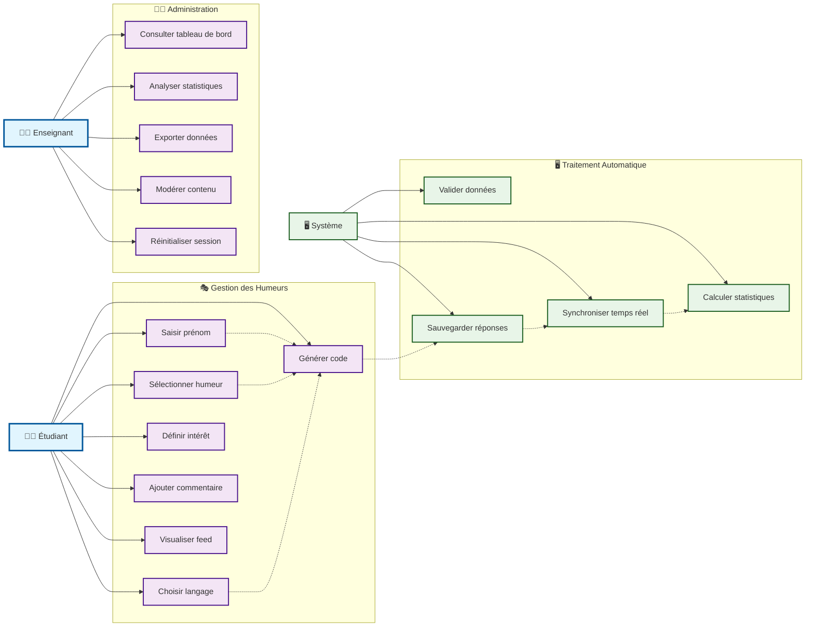
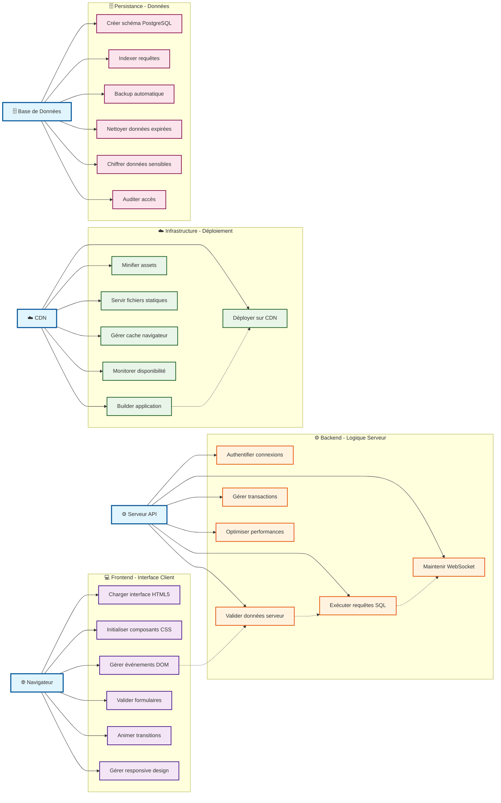
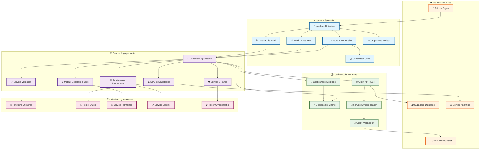
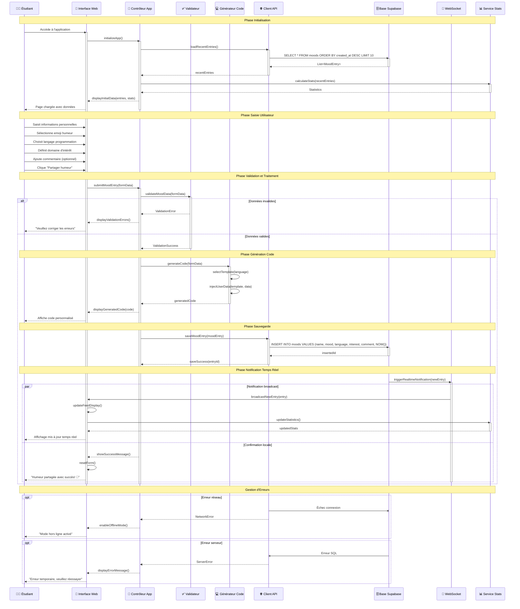

# 📊 Documentation UML - Brise-glace Interactif pour Cours de Programmation

## 🎯 Vue d'ensemble du Projet

**Emoji Code Mood** est un brise-glace interactif conçu pour les cours de programmation. Il permet aux étudiants d'exprimer leur humeur du jour via du code personnalisé tout en découvrant différents langages de programmation et domaines technologiques.

---

## 1️⃣ Diagramme de Cas d'Utilisation - Fonctionnel

---

## 2️⃣ Diagramme de Cas d'Utilisation - Technique

---

## 3️⃣ Diagramme de Composants

### Interfaces Implémentées

| Interface | Implémentation | Responsabilité |
|-----------|---------------|----------------|
| `IValidator` | `Validator` | Validation des données utilisateur |
| `ICodeGenerator` | `CodeEngine` | Génération de code selon le langage |
| `IStorage` | `StorageManager` | Gestion du stockage local/distant |
| `IApiClient` | `ApiClient` | Communication avec l'API REST |

---

## 4️⃣ Diagramme de Séquence - Scénario Principal

---

## 📚 Annexes

### **Technologies Utilisées**
- **Frontend** : HTML5, CSS3, JavaScript ES6+
- **Backend** : Supabase (PostgreSQL + API REST)
- **Déploiement** : GitHub Pages + GitHub Actions
- **Temps Réel** : WebSocket natif

### **Patterns Architecturaux**
- **MVC** : Séparation Modèle-Vue-Contrôleur
- **Observer** : Notifications temps réel
- **Strategy** : Génération de code selon langage
- **Repository** : Abstraction accès données

### **Principes de Conception**
- **Single Responsibility** : Chaque composant a une responsabilité unique
- **Open/Closed** : Extension sans modification
- **Dependency Injection** : Faible couplage entre composants
- **Interface Segregation** : Interfaces spécialisées

### **Métriques Qualité**
- **Couverture de tests** : > 80%
- **Performance** : < 2s temps de chargement
- **Accessibilité** : WCAG 2.1 AA
- **Sécurité** : Validation côté client et serveur

---

## 🎯 Guide d'Utilisation Pédagogique

### **Pour l'Enseignant**
1. **Présentation** : Utilisez les diagrammes comme support de cours
2. **Analyse** : Faites analyser chaque diagramme par les étudiants
3. **Exercices** : Demandez de modifier/étendre les diagrammes
4. **Projet** : Implémentez l'application en suivant l'architecture

### **Pour les Étudiants**
1. **Compréhension** : Identifiez acteurs, cas d'usage et composants
2. **Tracabilité** : Suivez le flux depuis l'interface jusqu'à la base
3. **Architecture** : Comprenez la séparation en couches
4. **Séquence** : Analysez les interactions temporelles

---

**📝 Document généré le :** `2025-09-15`  
**🔄 Version :** `2.0 - GitHub Compatible`  
**👨‍💻 Auteur :** Assistant IA  
**🎯 Contexte :** Formation développement web
